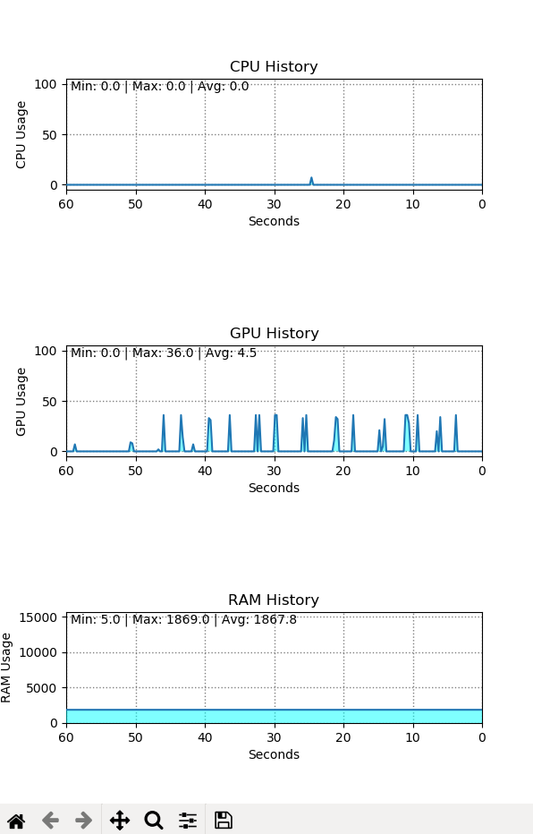

# Jetson Usage Graph

Graphs of CPU, GPU, RAM usage for Jetson Xavier.


## Dependencies

- python3
- matplotlib


## Run

```buildoutcfg
python3 main.py {--view_diff}
```

option

--view_diff: Set initial values to (CPU, GPU, RAM) usage values at start, not zeros



Avg. value means average for last 10 seconds

Test board: Jetson Xavier


## Reference

[Github rbonghi/jetson_stats](https://github.com/rbonghi/jetson_stats)

[Github jetsonhacks/gpuGraphTX](https://github.com/jetsonhacks/gpuGraphTX)
